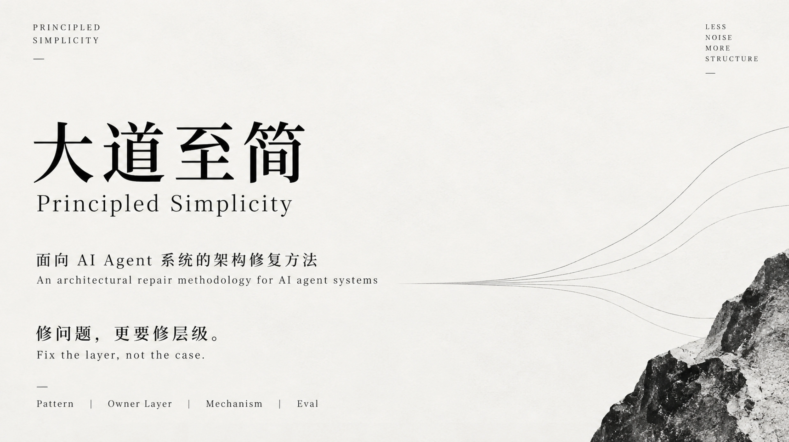

# Principled Simplicity · 大道至简 Skill

<p align="center">
  
</p>

**Fix the layer, not the case.**

A mechanism-level architecture repair skill distilled from real AI / Agent engineering practice, designed for developing and repairing AI-agent runtimes and harnesses.

It does not rush to answer “how do I patch this badcase?” It asks a harder question first: **why does this problem keep returning, and which layer should actually own the fix?**

[中文](README.md) · [SKILL.md](SKILL.md) · [Examples](examples/) · [References](references/)

---

## Why this exists

AI systems easily fall into a pattern that feels productive but is actually running in circles:

- one badcase → add one prompt line
- another case → add keywords
- routing fails → add an if/else
- multi-turn failure → add another rule
- fix A → break B

Each local fix appears to work, while the system becomes harder to understand, evaluate, and maintain — until it effectively loses extensibility.

**Principled Simplicity is not about patching faster. It is about finding a stable mechanism that solves a class of failures.**

> **A good fix lets the system forget the exception instead of remembering more of them.**

---

## A typical example

### Input

> The agent chose the wrong tool again. Last time we added keyword rules. This time the user phrased it differently and routing failed again. Should we add more triggers?

### It does not start with another keyword list

It asks four questions first:

```text
1. How many times has this problem appeared?
2. How many places contain logic for handling it?
3. Is there an objective eval for “fixed”?
4. Did the previous fix make anything else worse?
```

If the failure repeats and the decision logic is spreading, this is no longer about one missing phrase. It is likely a **Routing / System Boundary** problem.

A stronger path becomes:

```text
keyword patches
    ↓
intent / tool-selection contract
    ↓
stable router
    ↓
verifier
    ↓
positive + negative + boundary regression set
```

The goal is not to make one sentence pass. The goal is to make **the entire class of paraphrases stop breaking the system**.

→ [Full example: Architecture Whack-a-Mole](examples/architecture-whack-a-mole.md)

---

## Core workflow

```text
case → pattern → mechanism → reusable skill/module → evaluation loop
```

### 1. Decide whether the issue deserves abstraction

Not every bug should become architecture.

| Signal | Judgment |
|---|---|
| First occurrence, isolated impact | A case fix may be enough |
| Similar failures keep returning | Look for the pattern |
| The same logic exists in multiple places | Inspect system boundaries |
| Changes only “feel better” | Build the eval first |
| Repeated fixes keep failing | Force an architecture review |

**Premature abstraction is also an anti-pattern.**

### 2. Locate the failed layer

| Failure Type | Typical signal |
|---|---|
| **Semantic** | Paraphrases defeat enumerable rules |
| **Context** | Single-turn works; multi-turn / cross-session fails |
| **Routing** | Wrong tool or mode; surface-keyword matching dominates |
| **System Boundary** | Logic is duplicated; prompts are doing code's job |
| **Evaluation** | Many changes, no objective success criterion |

### 3. Choose the right abstraction level

```text
case fix
pattern rule
mechanism
module
skill
harness
migration path
```

The goal is not “the highest abstraction.” The goal is to **put complexity in the layer that should own it**.

---

## When to use it

### Prompt bloat

> “Every badcase adds another clause to the system prompt. Nobody dares remove anything now.”

→ Check whether the behavior belongs in state, routing, verification, context construction, or code constraints.

### Wrong tool selection

> “We already added a dozen keyword triggers. A paraphrase still breaks routing.”

→ Move from surface rules to routing mechanism + eval.

### Duplicated logic

> “The same decision exists in the prompt, backend, and tool layer.”

→ Inspect the system boundary instead of synchronizing three patches.

### Rule or model?

> “Should this be an if/else or another LLM call?”

→ Decide from boundary stability, error cost, enumerability, and evaluability.

---

## When not to use it

- a genuine one-off edge case
- a temporary demo patch with explicitly accepted debt
- a first occurrence with no repetition signal yet
- pure visual or stylistic changes

Principled Simplicity is not “refactor everything.” **Unnecessary abstraction is complexity too.**

---

## Use

```bash
git clone https://github.com/Longfellow1/Principled-Simplicity-skill.git
cd Principled-Simplicity-skill
```

The core skill is [`SKILL.md`](SKILL.md). It can be used with Claude Code, Codex, or other agent workflows that support reusable skills or system-instruction injection.

For codebases, the scanner can provide additional observed evidence:

```bash
python references/deep-fix-scan.py /path/to/project
```

The script observes. The skill judges.

Repository structure:

```text
Principled-Simplicity-skill/
├── SKILL.md
├── README.md
├── README.en.md
├── assets/
│   └── hero.webp
├── references/
│   ├── patterns.md
│   ├── procedure.md
│   ├── heuristics.md
│   ├── abstraction-readiness.md
│   ├── prompt-decompose.md
│   ├── patch-audit.md
│   └── deep-fix-scan.py
└── examples/
    ├── architecture-whack-a-mole.md
    └── eval-blindspot.md
```

---

## Origin

**Principled Simplicity / 大道至简 is an independent methodology distilled from real AI / Agent engineering practice.**

It comes from a recurring engineering observation: when prompts, rules, routing, context, and state start patching one another, another local fix often just relocates complexity.

“Simplicity” here does not mean fewer lines of code or prettier architecture. It means:

> **Once the correct abstraction exists, unnecessary special cases no longer need to exist.**

---

## Companion skill

If the problem is still upstream — “should this demand be built at all?” — use:

**[Product Judgment · 产品判断](https://github.com/Longfellow1/Product-Judgment-skill)**  
*Judge the demand before writing the PRD.*

---

## License

Apache-2.0
